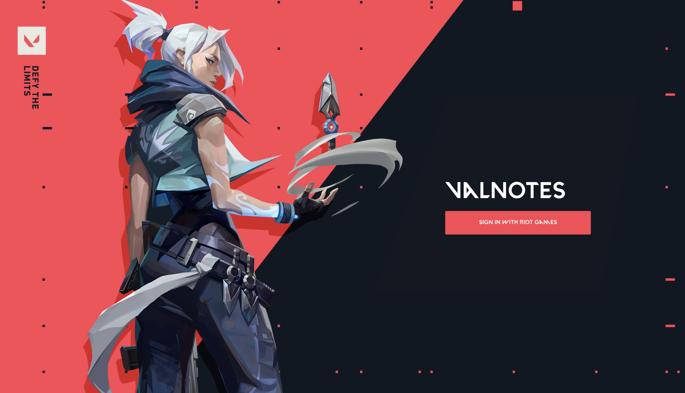
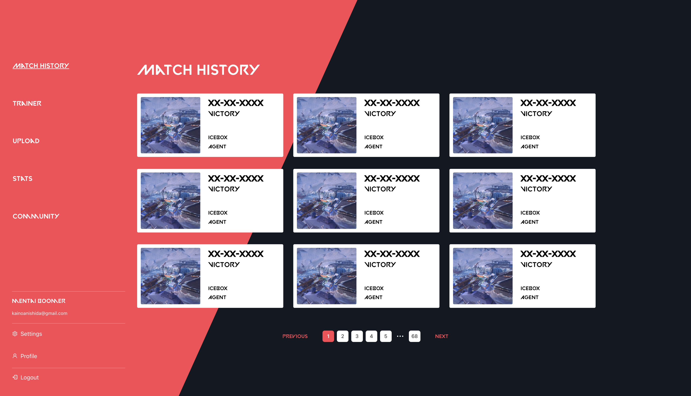
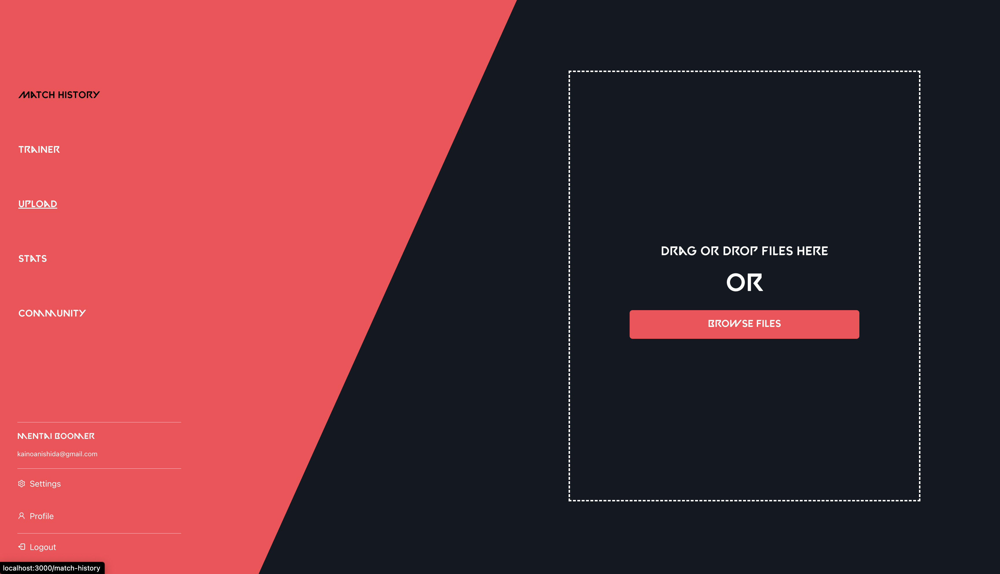
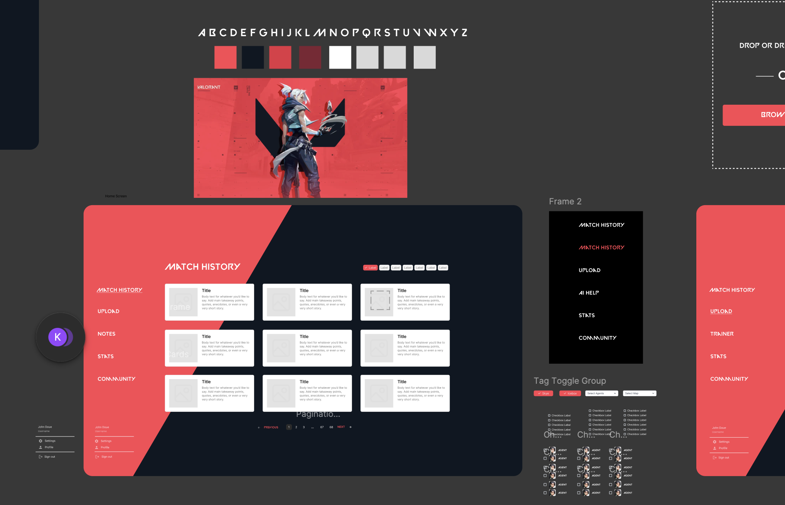
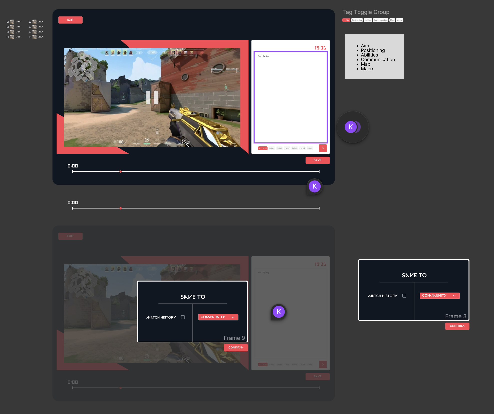
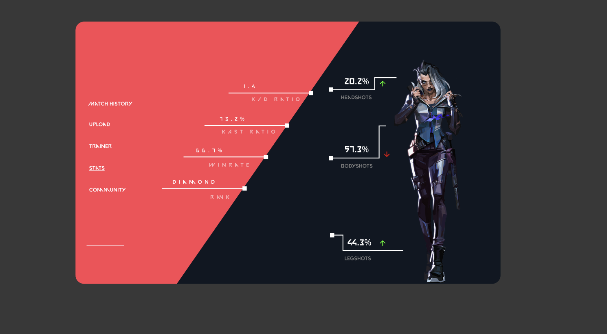
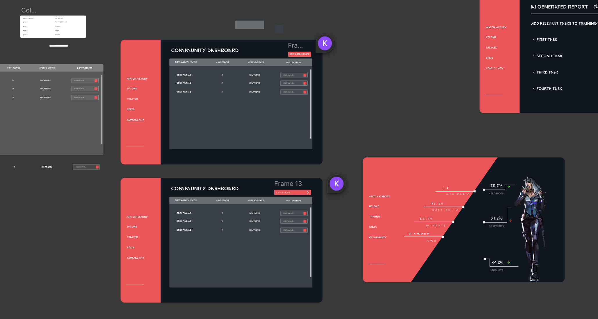

# Valnotes

Valnotes is a web application that allows users to log and annotate their Valorant match history videos, providing a powerful tool for game improvement and strategy analysis.

## Features

- User authentication via Riot Games API
- Profile management for Valorant players
- Video logging of match history
- Note-taking functionality for each video
- Database storage for easy retrieval of notes and videos

## Tech Stack

- Frontend: React
- Backend: Node.js
- Database: PostgreSQL
- Authentication: Riot Games API

## Getting Started

### Prerequisites

- Node.js
- npm
- PostgreSQL
- Riot Games API credentials

### Installation

1. Clone the repository:
   ```
   git clone https://github.com/yourusername/valnotes.git
   ```

2. Navigate to the project directory:
   ```
   cd valnotes
   ```

3. Install dependencies:
   ```
   npm install
   ```

4. Set up your environment variables (database connection, Riot API keys, etc.)

5. Start the development server:
   ```
   npm start
   ```

## Usage

1. Sign In using your Riot Account
2. It will retrieve all of your match history, but initially each game will be empty. You must upload personally recorded VODs in the Upload page, and then record any notes while you review your VOD.


## Screenshots






## Figma Designs

Click below to look at the designs of the Valnotes APP!
[Link](https://www.figma.com/design/lMWOd0VHeMCxDB6uRjU796/Material-UI-for-Figma-(and-MUI-X)-(Community)?node-id=7603-15383&t=pe8LOI0r0W8wnWxo-1)







## Acknowledgments

- Riot Games for providing the API
